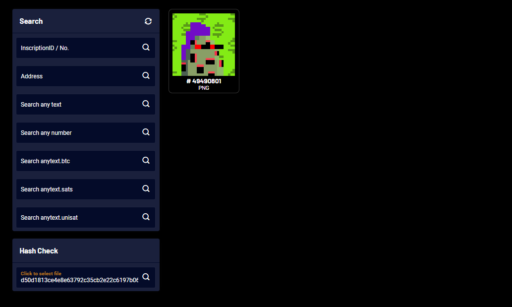

# Monkes Twenty One  -  20+ Available Twin & Triplet Mints?  Second-Is-Second, Third-Is-Third 

As of Dec/22 the image-hash matchting indexer found 20978 of 21000 monkes.  22 not indexed and not yet minted. 
possible? why? 

Please, double and triple check here  <https://bitpunks.io/Explorer/Inscriptions> for second-is-second and third-is-third.

how to: at the left-bottom hash check box add your (28x28px) image file 
and it will show all matching inscriptions.  
example: no monke 1734 (twin of 174) yet?

Twins?! Triplets?!  

> The monkes twenty one (monkes21) collection 
> has 21000 items (20000 monkes + 1000 rocks).
>
> - 20918  unique image hashes - first-is-first
> - 35×2   duplicate image hashes - first-is-first, second-is-second
> - 4×3    triplicate image hashes - first-is-first, second-is-second, third-is-third
>
> 21000 = 20918 + 35×2 + 4×3 
>
> See [**First-Is-First (Second-Is-Second, Third-Is-Third) Image Hash (SHA256) Check »**](HASHCHECK.md)

The missing mints:

monke 1734 (twin of 174)   - second-is-second  
-  563ae745287d6aa9e37f62f4c6780411f028aeaeb7b2575f7d80e2f7284e91b0
   -  [174, 1734]

monke 2131 (twin of 2071)  - second-is-second  
-  81710ee93803f109970b6a0201a129c7d1e6abe46bef1719b968c42b75937970
   -  [2079, 2131]

monke 3078  (twin of 348)  - second-is-second  
-  25308011cd325eeeae67bb3b69ebef8bcc4cccd66067ffd5db6421892e63c4a8
   -  [348, 3078]

monke 3795 (2nd triplet of 2105)   - second-is-second  
-  8b43d085f58d1e3d9f4c19bbd853d1fda59deab99afb16710af240ad5bb351c2
   -  [2105, 3795, 14221]

monke 4393 (twin of 3769)  - second-is-second   
-  72a1e2f00c87072b43d60a92344fa9827bf498a98decb9b512b27701c2e5323c
   -  [3769, 4393]

monke 7636  (twin of 6856)  - second-is-second   
-  9bef26e8d07d76ac5cc4221ed08195556c35a05173474ef7f6ab24060be206e7
   -  [6856, 7636]

monke 8069 (twin of 659)    - second-is-second   
-  217fa4dc44588cd73d7df31942c0affdcd04bc7955221055f662ed51bcf44184
   -  [659, 8069]

monke 8433  (twin of 1803)   - second-is-second    
-  bec86cad11a415b2c17479729678837ce80bb47e5cc6c29f162b318c2b63c3fb
   -  [1803, 8433]   

monke 10139 (3rd triplet of 3457)     - third-is-third   
-  48b9497602d6877c543ff0aac83f332cf66532a73460f444542e143e25d2dce6
   -  [3457, 8397, 10139]

monke 11179   (twin of 6837)     - second-is-second   
-  2f0a267d61dcdc6a5ae584c0de5edf5560318ba1ec3895baf3b23317ea037ee0
   -  [6837, 11179]

monke 11985   (twin of 3509)   - second-is-second    
-  e4d7386f4ffdaea66971c9b0bfe71282d9babb25d95a2d450afb194e8005f970
   -  [3509, 11985]

monke 12854  (twin of 3104)   - second-is-second    
-  43ee770855a3c48c7e1b122ee14856958a6bcb1fda9492f7c1a9cfe893cc5900
   - [3104, 12854]

monke 13737 (twin of 5157)   - second-is-second    
-  504a5bd3c77af40afebfd93aecedc598f24b595e0afcceeadcb5fee0b7f05342
   - [5157, 13737]

monke 13961  (3rd triplet of 2937)    - third-is-third   
-  3259208a72b34c9558c20d1315077e2cbf459ac22e4bb07cfe64877e9c6b0aa5
   - [2937, 8423, 13961]

monke 14221  (3rd triplet of 2105)   -  third-is-third   
-  8b43d085f58d1e3d9f4c19bbd853d1fda59deab99afb16710af240ad5bb351c2
   -  [2105, 3795, 14221]

monke 14897  (twin of 7903)   - second-is-second   
-  dfa3e280f785e3f7c76e11ebdf97e5c6dcc72613088ff76c29ab0a7289baf3f1
   - [7903, 14897]

monke 15350 (twin of 3260)   - second-is-second   
-  7179cb8cc765a19435dfd4a18b3faf81cbc336b47ced2f3db8a2529aff22b8c6
   - [3260, 15350]

monke 17672 (twin of 4022)   - second-is-second   
-  2bb54a03c98a245923fc5897634d587d1f6627098ce1529ead1021dceb92d7db
   - [4022, 17672]

monke 17820 (twin of 7680)     - second-is-second   
-   ca25f05a23d793de126175f485e9ae50fa48cb663a95546a128fdb845940ced6
    - [7680, 17820]

monke 18417  (twin of 2817)     - second-is-second   
-   55b070c55f9fd2f228bee29eee0142177d2e3e6debfd57d26cb2dccd76c74e58
    - [2817, 18417]

monke 19206  (twin of 14136)    - second-is-second   
-  ddc5018916244347cf5b7033824bf0874f45a75fa95cc3f7c0b3da431c66c716
   - [14136, 19206]

monke 20543 (twin of 20063)    - second-is-second    
-   d50d1813ce4e8e63792c35cb2e22c6197b06e550e954d19e81925494281c6b91
    - [20063, 20543]

