# Monkes Twenty One (Monkes21)

21000 unique monkes, colorful 28x28 pixel art. Long bitcoin, Long monkes!


## What's News?

Twenty One Line Art (Monkes 21) Rocks! - New Special Art Edition


## Special Art Collection - Editions (21 Max. Each)

### 21 Rock Lines

the fam in 4x

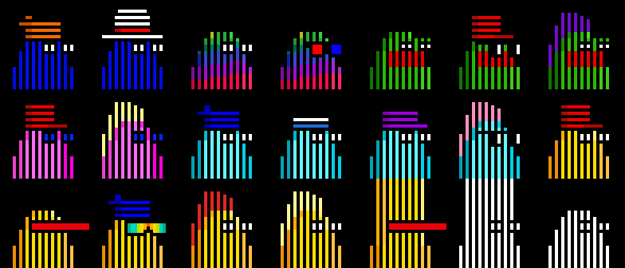

Find all 21 reference images (28×28px) in [/rocklines/inscribe](inscribe):

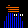

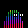

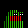
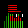
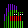
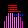

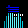
...


## Self inscribing, First is first

<details>
<summary markdown="1">How to</summary>


- Monkes Twenty One is a free self inscribe collection, only the first confirmed inscription of each image (in 28x28px) is counted as part of the collection.
- You can check a monke's availability by using the check button below it's image. NOTE: This doesn't include any unconfirmed inscriptions, you can check unconfirmed inscriptions on Unisat.
- The status of the monke will appear on the bottom right of the page, if it's free; right click save as .PNG and inscribe using your favorite service.
- Confirmed taken monkes will appear grayed out, updates on confirmed taken monkes will happen periodically.
- Always use the check button as some monkes will be inscribed but not be confirmed taken.  Find the confirmed taken monkes
in the tabular [monkes21/mint.csv](https://github.com/orc721/market/blob/master/monkes21/mint.csv) dataset.      
- Questions? Comments? Join the [ordbase community discord](https://discord.gg/dDhvHKjm2t).


</details>


---

### Mint web

  - <https://orc721.github.io/monkes21>

  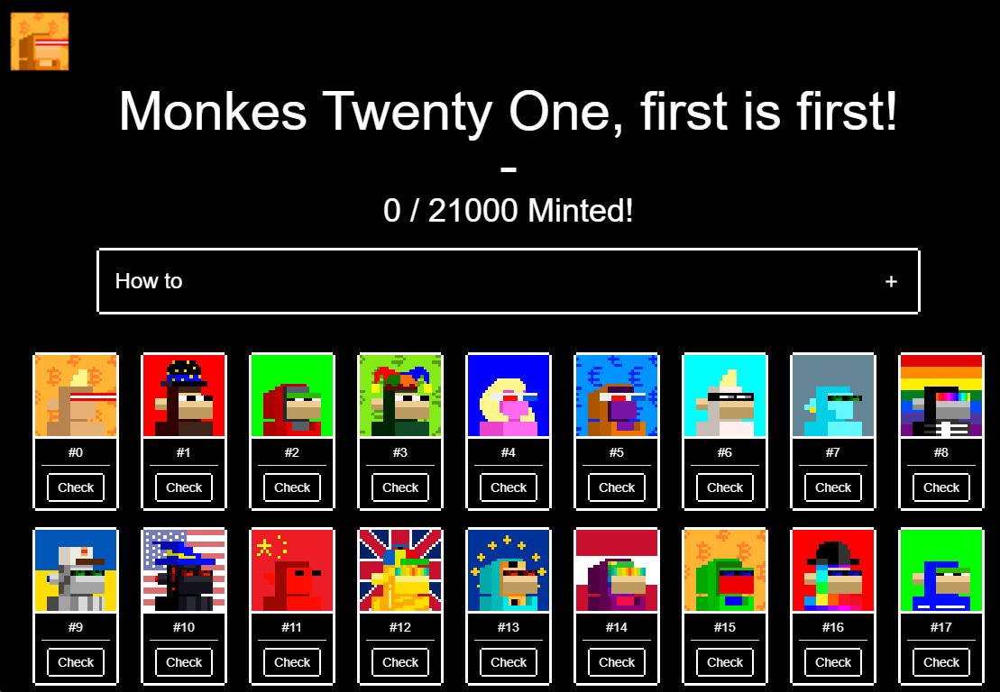
  
---

### Marketplace

  - <https://magiceden.io/ordinals/marketplace/monkes21>

  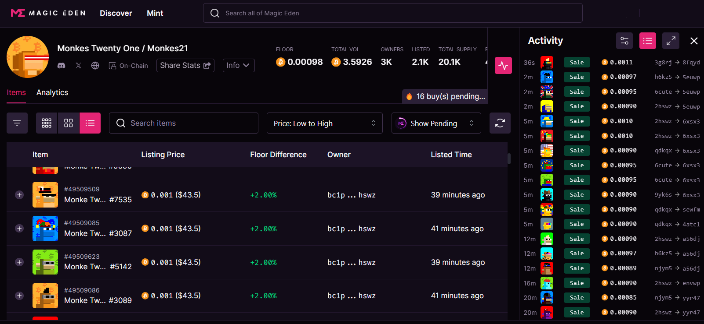

  
  - <https://www.okx.com/web3/marketplace/nft/collection/btc/monkes-twenty-one-monkes21>


---


## More About Monkes 21

Find all 21 000 reference images (28×28px) in [/inscribe](inscribe):


...


Find all meta data in the [monkes21.csv](monkes21.csv) tabular dataset e.g.

```
id, type, attributes, background
0, light small, mohawk2 blonde / lasereyes red, bitcoin pattern
1, brown, tophat midnight, red
2, gray, hoodie red / eyes pepe, green
3, green, jesterhat, dollar pattern
4, pink small, bob blonde small / 3d glasses, blue
5, purple small, hoodie orange / 3d glasses, euro pattern
6, white, mohawk2 blonde / eyemask, aqua
7, alien, earring / eyes bot green, classic
8, boned, shades rainbow, rainbow
9, bot, cap burgerking / eyes bot green, ukraine
...
```

###  Popularity & Rarity by Types 


|  Type                                               | Pop             |
|-----------------------------------------------------|----------------:|
|  rock golden block   |   10  ( 0.05 %) |
|  rock gray block   |   11  ( 0.05 %) |
|  rock albino    |   25  ( 0.12 %) |
|  rock dark      |   38  ( 0.18 %) |
|  rock gray      |   52  ( 0.25 %) |
|  rock golden    |   53  ( 0.25 %) |
| 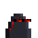 rock deathbot   |   62  ( 0.30 %) |
|  rock alien     |   62  ( 0.30 %) |
|  rock pepe      |   62  ( 0.30 %) |
|  rock memepool   |   62  ( 0.30 %) |
|  rock green     |   62  ( 0.30 %) |
|  rock safemode   |   62  ( 0.30 %) |
|  rock pink      |   62  ( 0.30 %) |
| 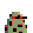 rock zombie    |   62  ( 0.30 %) |
|  rock demon     |   63  ( 0.30 %) |
|  rock default   |   63  ( 0.30 %) |
|  rock black     |   63  ( 0.30 %) |
|  rock maxibiz   |   63  ( 0.30 %) |
|  rock brown     |   63  ( 0.30 %) |
|  maxibiz6       |   79  ( 0.38 %) |
|  maxibiz4       |   88  ( 0.42 %) |
|  punk           |   90  ( 0.43 %) |
|  maxibiz5       |   93  ( 0.44 %) |
| 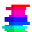 squiggle       |   96  ( 0.46 %) |
|  maxibiz3       |  101  ( 0.48 %) |
|  maxibiz2       |  106  ( 0.50 %) |
|  maxibiz        |  116  ( 0.55 %) |
|  orange2        |  137  ( 0.65 %) |
|  orange         |  145  ( 0.69 %) |
|  pepe block     |  153  ( 0.73 %) |
|  light small    |  165  ( 0.79 %) |
|  dark small     |  179  ( 0.85 %) |
|  albino small   |  197  ( 0.94 %) |
|  medium small   |  229  ( 1.09 %) |
|  orange2 orc    |  235  ( 1.12 %) |
|  orange orc     |  252  ( 1.20 %) |
|  blue           |  281  ( 1.34 %) |
|  greener        |  288  ( 1.37 %) |
|  gold           |  289  ( 1.38 %) |
|  gray           |  376  ( 1.79 %) |
|  red            |  382  ( 1.82 %) |
|  purple small   |  383  ( 1.82 %) |
|  green small    |  384  ( 1.83 %) |
|  green          |  386  ( 1.84 %) |
|  white          |  387  ( 1.84 %) |
|  purple         |  387  ( 1.84 %) |
|  gray small     |  394  ( 1.88 %) |
|  gold orc       |  480  ( 2.29 %) |
|  greener orc    |  481  ( 2.29 %) |
|  blue orc       |  488  ( 2.32 %) |
|  pepe           |  616  ( 2.93 %) |
|  rainbow        |  769  ( 3.66 %) |
|  hyena          |  769  ( 3.66 %) |
|  golden         |  769  ( 3.66 %) |
|  demon          |  769  ( 3.66 %) |
| 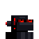 deathbot       |  769  ( 3.66 %) |
|  bot            |  769  ( 3.66 %) |
| 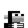 boned          |  769  ( 3.66 %) |
|  alien          |  769  ( 3.66 %) |
|  default        |  769  ( 3.66 %) |
|  safemode       |  769  ( 3.66 %) |
|  mempool        |  769  ( 3.66 %) |
|  black          |  769  ( 3.66 %) |
| 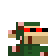 zombie         |  769  ( 3.66 %) |
|  brown          |  770  ( 3.67 %) |
|  pink small     |  770  ( 3.67 %) |


### Bonus - All together now

Find the composite fam image of all 21000 in a 200×105 grid in [monkes21.png](monkes21.png) (~3.7MB - 5000×2940px).


## Builders Corner - Yes, You Can

For reference find all (generative) attributes (base types and accessories) in 28×28px in [**/attributes @ ordbase/monkesee-monkedo**](https://github.com/ordbase/monkesee-monkedo/tree/master/attributes) &
[**/attributes @ ordbase/letsrock »**](https://github.com/ordbase/letsrock/tree/master/attributes)

Yes, you can regenerate this monkes 28px set 
using the generate_meta script
and using the generate script to generate all images
from the tabular datasets. 

- <https://github.com/ordbase/monkesee-monkedo> - first 20000 (0 to 19999)
- <https://github.com/ordbase/letsrock>   - last 1000 (20000 to 20999)


## Questions? Comments?


Join us in the [Ordbase (Incl Ordgen / ORC-721) discord (chat server)](https://discord.gg/dDhvHKjm2t). Yes you can.
Your questions and commentary welcome.

Or post them over at the [Help & Support](https://github.com/geraldb/help) page. Thanks.
