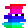
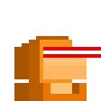
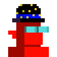
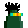
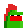
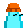
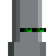
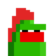

The Do-It-Yourself (DIY) [Factory of Modern Originals (FoMO)](https://github.com/profilepic/originals) Presents


# Monkes Twenty One / Monkes 21  (Pixel Avatar)

Yes, you can! Generate your own monkes twenty one 28×28 pixel avatar images from the 100+ official text attributes (via built-in spritesheet); incl. 2x/4x/8x zoom for bigger sizes and more


* home  :: [github.com/orc721/monkes21](https://github.com/orc721/monkes21)
* bugs  :: [github.com/orc721/monkes21/issues](https://github.com/orc721/monkes21/issues)
* gem   :: [rubygems.org/gems/monkes21](https://rubygems.org/gems/monkes21)
* rdoc  :: [rubydoc.info/gems/monkes21](http://rubydoc.info/gems/monkes21)


##  Usage

Let's generate some monkes twenty one  (pixel) avatars / characters.


Using  the `fab` (or `fabricate`) command line tool, see [Factory of Modern Originals (FoMO) ](https://github.com/profilepic/originals). 

```
$ fab monke21 orange_orc hoodie_orange lasereyes_red
$ fab monke21 demon tophat_midnight shades_cool
$ fab monke21 squiggle eyes_left
```

via script:

``` ruby
require 'monkes21'

monke = Monke21::Image.generate( 'orange orc', 'hoodie orange', 'lasereyes red' )
monke.save( "monke1.png")
monke.zoom(4).save( "monke1@4x.png" )

monke = Monke21::Image.generate( 'demon', 'tophat midnight', 'shades cool' )
monke.save( "monke2.png")
monke.zoom(4).save( "monke2@4x.png" )

monke = Monke21::Image.generate( 'squiggle', 'eyes left' )
monke.save( "monke3.png")
monke.zoom(4).save( "monke3@4x.png" )
```


Voila!




In 4x:





Let's rock. Via command line:

```
$ fab monke21 rock_gray_block eyes_green
$ fab monke21 rock_green wildhair eyes_polarized
$ fab monke21 rock_pepe mohawk_red
$ fab monke21 rock_alien knittedcap
```

via script:

``` ruby
monke = Monke21::Image.generate( 'rock gray block', 'eyes green' )
monke.save( "monke4.png")
monke.zoom(4).save( "monke4@4x.png" )

monke = Monke21::Image.generate( 'rock green', 'wildhair', 'eyes polarized' )
monke.save( "monke5.png")
monke.zoom(4).save( "monke5@4x.png" )

monke = Monke21::Image.generate( 'rock pepe', 'mohawk red' )
monke.save( "monke6.png")
monke.zoom(4).save( "monke6@4x.png" )

monke = Monke21::Image.generate( 'rock alien', 'knittedcap' )
monke.save( "monke7.png")
monke.zoom(4).save( "monke7@4x.png" )
```


Voila!






In 4x:






And so on.


## Questions? Comments?


Join us in the [Ordbase (Incl Ordgen / ORC-721) discord (chat server)](https://discord.gg/dDhvHKjm2t). Yes you can.
Your questions and commetary welcome.

Or post them over at the [Help & Support](https://github.com/geraldb/help) page. Thanks.